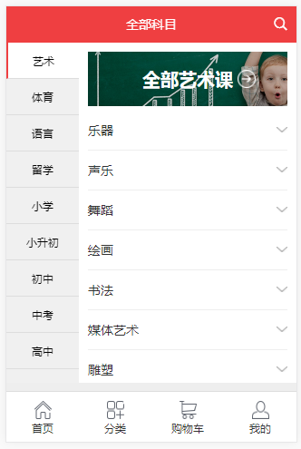
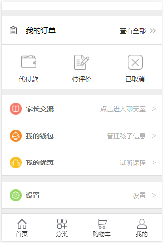
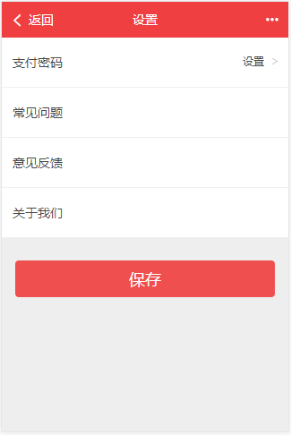

# 服务器端

[node服务器](https://github.com/1520306916/vue-ssr-sever)


# 完成功能

- [x] 首页渲染


- [x] 课程的分类搜索


- [x] 课程 按 （智能排序 价格最高 价格最低 老师好评 人气最高） 排序


- [ ] 课程 按 （班级类型 活动优惠 上课时间（周一到周日） 具体时间（上午下午晚上） 价格区间） 筛选

- [x] 完成课程列表的下拉加载更多


- [ ] 课程详情


- [ ] 预约试听


- [x] 分类页面


- [x] 我的页面


- [ ] 提交订单


- [ ] 登录（注册暂无）


- [x] 设置页面


- [x] 优惠券页面


- [x] 钱包页面


- [ ] 购物车 （添加购物车 删除购物车 结算购物车 购物车批量提交订单）


- [ ] 我的订单 （全部订单 待付款 交易成功）


- [ ] redis (首页缓存 分页缓存）


- [ ] 阿里云部署





# nuxt

> Nuxt.js project

## Build Setup

``` bash
# install dependencies
$ npm install # Or yarn install

# serve with hot reload at localhost:3000
$ npm run dev

# build for production and launch server
$ npm run build
$ npm start

# generate static project
$ npm run generate
```

For detailed explanation on how things work, checkout the [Nuxt.js docs](https://github.com/nuxt/nuxt.js).
